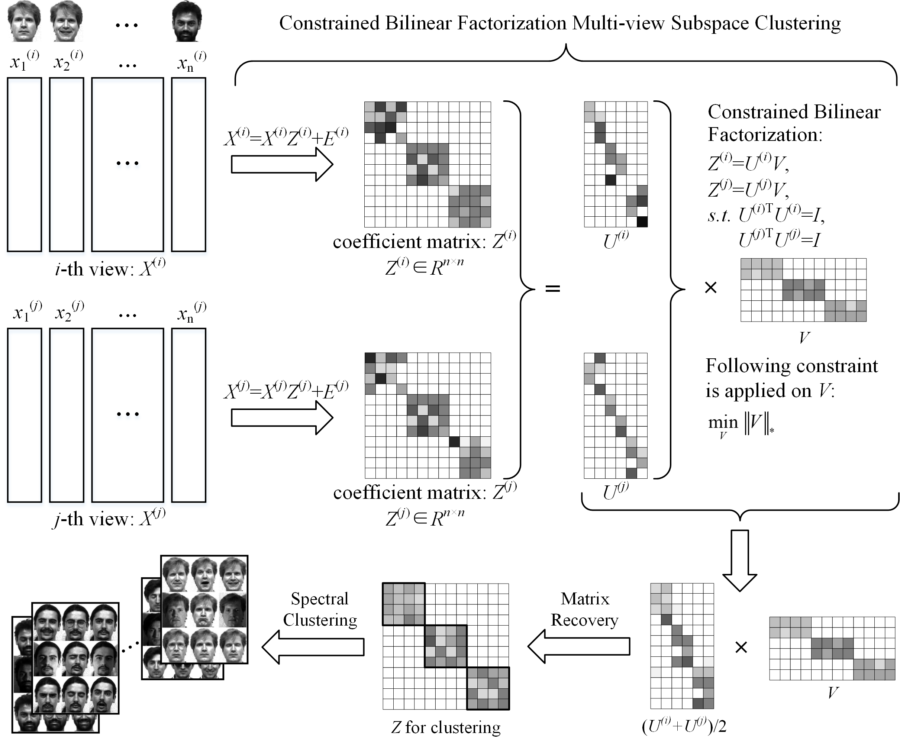

# CBF-MSC
Source codes of the work "Constrained Bilinear Factorization Multi-view Subspace Clustering" published in Knowledge-Based Systems 2020.

Some common used multi-view datasets and a demo-file of BBC-Sport are included in this repository.

If you find this repository useful in your research, please cite our works as follows, thanks.

@article\{CBF-MSC, 
      &nbsp;&nbsp;&nbsp;&nbsp;title=\{Constrained bilinear factorization multi-view subspace clustering\}, 
      &nbsp;&nbsp;&nbsp;&nbsp;author=\{Zheng, Qinghai and Zhu, Jihua and Tian, Zhiqiang and Li, Zhongyu and Pang, Shanmin and Jia, Xiuyi\}, 
      &nbsp;&nbsp;&nbsp;&nbsp;journal=\{Knowledge-Based Systems\}, 
      &nbsp;&nbsp;&nbsp;&nbsp;volume=\{194\}, 
      &nbsp;&nbsp;&nbsp;&nbsp;pages=\{105514\}, 
      &nbsp;&nbsp;&nbsp;&nbsp;year=\{2020\}, 
      &nbsp;&nbsp;&nbsp;&nbsp;publisher=\{Elsevier\} 
\} 

Email: zhengqinghai@stu.xjtu.edu.cn

